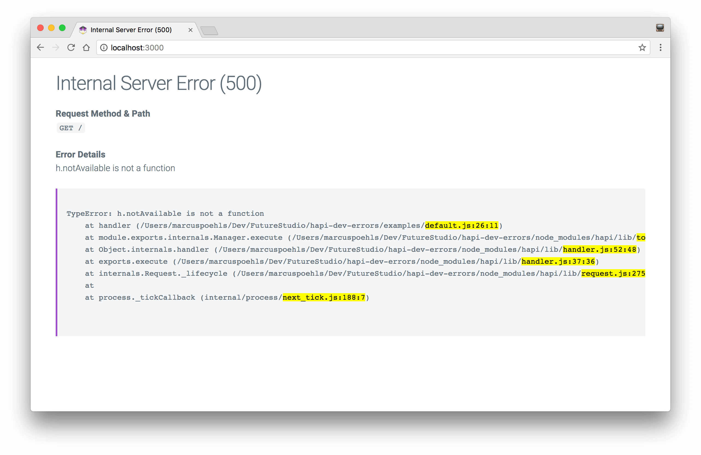

# hapi dev errors
A hapi plugin to return an error view for web requests, providing more details of the issue. Also, provides the
error stacktrace within the browser and you can skip the extra look at your command line to catch the issue.



## Requirements
The plugin is written in ES2015, please use **Node.js v4 or later**.


## Installation
Add `hapi-dev-errors` as a dependency to your project:

```bash
npm i -S hapi-dev-errors
# you’re using NPM shortcuts to (i)nstall and (-S)ave the module as a dependency

# NPM v5 users, please this way
npm i hapi-dev-errors
```


## Usage
**`hapi-dev-errors` is disabled by default to avoid leaking sensitive error details during production.**

Enable the plugin by define a "truthy" value for the `showErrors` option.

The most straight forward way to register the `hapi-dev-errors` plugin:

```js
server.register({
    register: require('hapi-dev-errors'),
    options: {
      showErrors: process.env.NODE_ENV !== 'production'
    }
  }, err => {
    if (err) {
        // handle plugin registration error
    }

    // went smooth like chocolate :)
})
```


## Plugin Registration Options
The following plugin options allow you to customize the default behavior of `hapi-dev-errors`:

- **showErrors**: `(boolean)`, default: `false` — by default, the plugin is disabled and keeps hapi's default error handling behavior
- **template**: `(string)`, no default — provide the template name that you want to render with `reply.view(template, errorData)`

```js
server.register({
    register: require('hapi-dev-errors'),
    options: {
        showErrors: process.env.NODE_ENV !== 'production',
        template: 'my-error-view'
    }
}, err => {
    if (err) {
        // handle plugin registration error
    }

    // do the heavy lifting :)
})
```


## Provided Values for Your Custom Error View
`hapi-dev-errors` supports the `template` option while registering the plugin. Provide a template name to
use your personal error template and not the default one shipped with `hapi-dev-errors`. In case you pass a string
value for the template name, the view will be rendered with `reply.view(template, errorData).code(500)`.

Available properties to use in your custom error view:

- `title`: error title like `Internal Server Error`
- `statusCode`: HTTP response status code (always 500)
- `message`: error message, like `Uncaught error: reply.view(...).test is not a function`
- `method`: HTTP request method, like `GET`
- `url`: URL request path, like `/signup`
- `headers`: HTTP request headers object, in key-value format`GET`
- `payload`: HTTP request payload, only available for HTTP methods other than `GET`, in key-value format
- `stacktrace`: error stacktrace


## Feature Requests
Do you miss a feature? Please don’t hesitate to
[create an issue](https://github.com/fs-opensource/hapi-dev-errors/issues) with a short description of your
desired addition to this plugin.


## Links & Resources

- [hapi tutorial series](https://futurestud.io/tutorials/hapi-get-your-server-up-and-running)


## Contributing

1.  Create a fork
2.  Create your feature branch: `git checkout -b my-feature`
3.  Commit your changes: `git commit -am 'Add some feature'`
4.  Push to the branch: `git push origin my-new-feature`
5.  Submit a pull request 🚀


## License

MIT © [Future Studio](https://futurestud.io)

---

> [futurestud.io](https://futurestud.io) &nbsp;&middot;&nbsp;
> GitHub [@fs-opensource](https://github.com/fs-opensource/) &nbsp;&middot;&nbsp;
> Twitter [@futurestud_io](https://twitter.com/futurestud_io)
